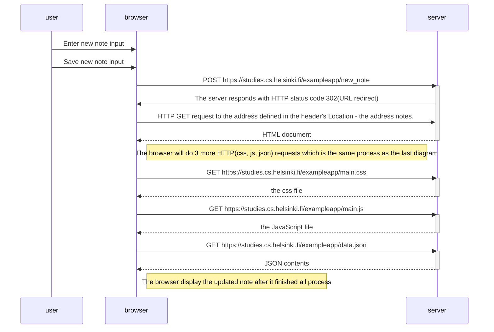

```mermaid
sequenceDiagram
    participant user
    participant browser
    participant server

    user->>browser: Enter new note input
    user->>browser: Save new note input

    browser->>server: POST https://studies.cs.helsinki.fi/exampleapp/new_note
    activate server
    server->>browser: The server responds with HTTP status code 302(URL redirect)
    
    browser->>server: HTTP GET request to the address defined in the header's Location - the address notes.
    server-->>browser: HTML document
    deactivate server

    Note right of browser: The browser will do 3 more HTTP(css, js, json) requests which is the same process as the last diagram
    
    browser->>server: GET https://studies.cs.helsinki.fi/exampleapp/main.css
    activate server
    server-->>browser: the css file
    deactivate server

    browser->>server: GET https://studies.cs.helsinki.fi/exampleapp/main.js
    activate server
    server-->>browser: the JavaScript file
    deactivate server

    browser->>server: GET https://studies.cs.helsinki.fi/exampleapp/data.json
    activate server
    server-->>browser: JSON contents
    deactivate server

    Note right of browser: The browser display the updated note after it finished all process
```
